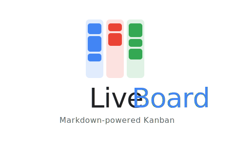
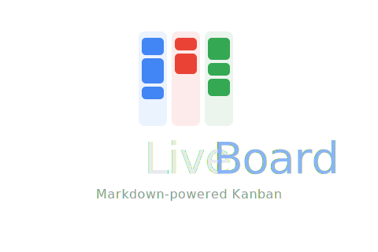

<p align="center">
  
</p>

<p align="center">
  <strong>Markdown-native, local-first Kanban</strong><br>
  <sub>Your tasks live as <code>.md</code> files in a folder you own.</sub>
</p>

<p align="center">
  <a href="#quickstart">Quickstart</a> · <a href="#board-format">Board Format</a> · <a href="#web-ui">Web UI</a> · <a href="#cli">CLI</a> · <a href="#rest-api">REST API</a> · <a href="#git-integration">Git</a>
</p>

-----

## Why LiveBoard?

No database. No proprietary format. No sync server. Just Markdown files, a Git repo, and a real-time web UI.

| | LiveBoard | Obsidian Kanban | Trello | Linear |
|---|:---:|:---:|:---:|:---:|
| Plain Markdown files | **Yes** | Yes | — | — |
| Local-first | **Yes** | Yes | — | — |
| Auto git commits | **Yes** | — | — | — |
| REST API | **Yes** | — | Yes | Yes |
| CLI | **Yes** | — | — | Partial |
| Real-time Web UI | **Yes** | — | Yes | Yes |
| No account required | **Yes** | Yes | — | — |

-----

## Quickstart

```bash
# Clone and run
git clone https://github.com/and1truong/liveboard.git
cd liveboard
make dev

# Open http://localhost:7070
```

Or run manually:

```bash
go run ./cmd/liveboard/... serve --dir ./demo --port 7070
```

-----

## Board Format

A board is a single `.md` file. H2 headings are columns, list items are cards.

```markdown
---
name: Product Roadmap
description: Planning upcoming features
tags: [product, roadmap]
---

## Backlog

- [ ] Add OAuth login
  tags: auth, backend
  priority: high

- [ ] Build mobile layout
  tags: ui

## In Progress

- [ ] Implement billing integration
  tags: payments
  assignee: hong

## Done

- [x] Create landing page
```

### Card metadata

Cards support inline metadata below the list item:

```markdown
- [ ] Implement billing integration
  tags: payments, billing
  assignee: hong
  priority: high
  due: 2025-07-01

  Notes go here. Supports full **Markdown**.
```

-----

## Web UI

The built-in web UI is a [LiveView](https://github.com/jfyne/live) application — real-time updates with no separate frontend build.

<p align="center">
  
</p>

**Features:**

- Drag-and-drop cards within and across columns
- Inline card editing (title, tags, priority, body, assignee)
- Column collapse/expand
- Multiple color themes (Indigo, GitHub, GitLab, Emerald, Rose, Sunset)
- Dark / light mode
- Responsive layout with mobile board dropdown

-----

## CLI

```bash
liveboard board list
liveboard board create <name>
liveboard board delete <name>

liveboard card add <board> "<title>"
liveboard card move <board> <index> "<column>"
liveboard card complete <board> <index>
liveboard card tag <board> <index> <tag> [tag...]
liveboard card show <board> <index>

liveboard column add <board> "<name>"
liveboard column rename <board> "<old>" "<new>"
liveboard column delete <board> "<name>"
```

-----

## REST API

The server runs locally on `http://localhost:7070`.

```
GET    /boards                    List all boards
POST   /boards                    Create a board
GET    /boards/{slug}             Get board details
DELETE /boards/{slug}             Delete a board

POST   /boards/{slug}/columns             Add a column
PATCH  /boards/{slug}/columns/{name}      Rename a column
DELETE /boards/{slug}/columns/{name}      Delete a column

POST   /boards/{slug}/columns/{name}/cards    Add a card
PATCH  /boards/{slug}/cards/{index}           Update a card
DELETE /boards/{slug}/cards/{index}           Delete a card
POST   /boards/{slug}/cards/{index}/move      Move a card
POST   /boards/{slug}/cards/{index}/complete  Toggle completion
```

-----

## Git Integration

Every write operation auto-commits the changed Markdown file with a structured message:

```
card: add "Implement OAuth login" → Backlog
card: move "billing integration" Backlog → In Progress
card: complete "Create landing page"
column: add "Review" to product-roadmap
board: create infra
```

-----

## Architecture

```
         ┌────────────────────────┐
         │     CLI (cobra)        │
         └───────────┬────────────┘
                     │
         ┌───────────▼────────────┐
         │    API Layer (chi)     │
         │   REST + LiveView     │
         └───────────┬────────────┘
                     │
      ┌──────────────┼──────────────┐
      │              │              │
┌─────▼──────┐ ┌─────▼──────┐ ┌────▼────────┐
│   Board    │ │   Parser   │ │    Git      │
│   Engine   │ │   Writer   │ │   Layer     │
└─────┬──────┘ └─────┬──────┘ └────┬────────┘
      │              │             │
      └──────────────┼─────────────┘
                     │
            ┌────────▼────────┐
            │  Markdown Files │
            │   (.md on disk) │
            └─────────────────┘
```

**Markdown is the single source of truth. Everything else is derived.**

-----

## Project Layout

```
liveboard/
├── cmd/liveboard/        CLI entrypoint + serve command
├── internal/
│   ├── api/              REST handlers (chi router)
│   ├── board/            Board engine, CRUD operations
│   ├── git/              go-git auto-commit integration
│   ├── parser/           Markdown → Board model
│   ├── writer/           Board model → Markdown
│   ├── web/              LiveView handlers + views
│   ├── workspace/        Folder scanning, board resolution
│   └── templates/        HTML templates
├── pkg/models/           Board, Column, Card types
├── web/
│   ├── css/              Stylesheets
│   ├── js/               Drag-and-drop, interactivity
│   └── img/              Logos and icons
├── demo/                 Sample boards
└── Makefile
```

-----

## Tech Stack

| Component | Library |
|---|---|
| Language | Go 1.24 |
| HTTP router | [chi/v5](https://github.com/go-chi/chi) |
| Real-time UI | [jfyne/live](https://github.com/jfyne/live) (LiveView) |
| CLI | [cobra](https://github.com/spf13/cobra) |
| Git | [go-git/v5](https://github.com/go-git/go-git) |
| Config | [yaml.v3](https://pkg.go.dev/gopkg.in/yaml.v3) |
| Frontend | Vanilla JS + [Alpine.js](https://alpinejs.dev/) |

-----

## Roadmap

- [x] Markdown parser + writer
- [x] Board engine (card/column CRUD)
- [x] REST API
- [x] CLI
- [x] Git auto-commit
- [x] Web UI with drag-and-drop
- [x] Theming (dark/light + color themes)
- [ ] TUI ([bubbletea](https://github.com/charmbracelet/bubbletea))
- [ ] Full-text search ([bleve](https://github.com/blevesearch/bleve))
- [ ] Event bus + SSE/WebSocket
- [ ] AI agent layer
- [ ] Cross-board card linking

-----

## License

MIT
